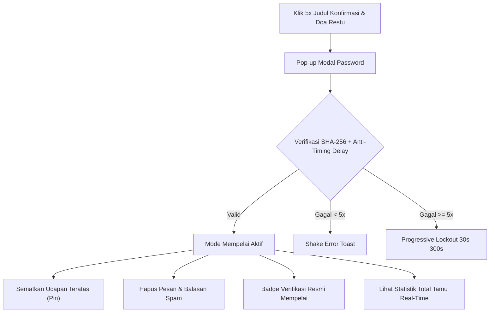

<div align="center">

# 💍 PAWIWAHAN THEME 1
### *Exclusive Digital Balinese Wedding Invitation Web Application*


<p align="center">
  <strong>Undangan Pernikahan Digital Adat Bali (Manusa Yadnya) Modern, Elegan, Interaktif, dan Terintegrasi Real-Time Cloud Firestore.</strong>
</p>

<p align="center">
  
  
  
  
  
  
</p>

</div>

## 📖 Tentang Proyek

**Pawiwahan Theme 1** adalah template undangan pernikahan digital bertema adat Bali yang dirancang dengan memadukan nilai kesakralan tradisi Hindu Bali (*Manusa Yadnya*) dan estetika web modern. Mengusung palet warna emas mewah (*Royal Gold*), tipografi *Cinzel Serif*, elemen gelombang dinamis, serta efek partikel gemerlap, platform ini memberikan impresi pertama yang hangat, megah, dan berkesan bagi para tamu undangan.

Dibangun dengan arsitektur **Vanilla Web Technologies** tanpa ketergantungan framework berat, situs ini menawarkan kecepatan muat maksimal (*high performance*), dukungan *Progressive Web App* (PWA) untuk akses luring (*offline*), serta sistem interaksi buku tamu real-time tanpa reload berkat integrasi **Google Cloud Firestore**.

---

## ✨ Fitur Unggulan

<table>
  <tr>
    <td width="50%">
      <h3>💌 1. Interactive Cover & Music Ambience</h3>
      <ul>
        <li><strong>Personalized Guest Name:</strong> Deteksi nama tamu otomatis via URL parameter (<code>?to=Nama+Tamu</code>) dengan algoritma <em>auto font scaling</em> agar nama panjang tidak terpotong.</li>
        <li><strong>Dynamic Particle Effect:</strong> Animasi hujan partikel emas (<em>gold dust</em>) saat undangan dibuka.</li>
        <li><strong>Background Music & Media Session:</strong> Pemutaran musik latar otomatis dengan integrasi <em>Web Media Session API</em> (kontrol play/pause langsung dari status bar ponsel/lockscreen).</li>
        <li><strong>Floating Audio Controller:</strong> Tombol status musik mengambang dengan notifikasi HUD real-time.</li>
      </ul>
    </td>
    <td width="50%">
      <h3>🕊️ 2. Informasi Mempelai & Mantra Suci</h3>
      <ul>
        <li><strong>Profil Mempelai Pria & Wanita:</strong> Menampilkan foto resolusi tinggi, silsilah keluarga, dan alamat asal kedua mempelai.</li>
        <li><strong>Kutipan Sloka Suci Rg Veda:</strong> Mantra suci pernikahan (<em>Rg Veda X.85.42</em>) beraksara latin dan terjemahan bahasa Indonesia yang mendalam.</li>
        <li><strong>Animasi Halus:</strong> Transisi elemen scroll yang disesuaikan secara dinamis menggunakan library AOS.</li>
      </ul>
    </td>
  </tr>
  <tr>
    <td width="50%">
      <h3>📅 3. Rangkaian Acara & Countdown</h3>
      <ul>
        <li><strong>Detail Upacara & Resepsi:</strong> Jadwal lengkap jam pelaksanaan dan lokasi acara.</li>
        <li><strong>Sinkronisasi Server Countdown:</strong> Hitung mundur akurat yang disinkronkan dengan <em>Server Time Offset</em> (mencegah ketidaksesuaian akibat pengaturan jam lokal perangkat tamu).</li>
        <li><strong>Add to Calendar:</strong> Integrasi 1-klik simpan jadwal ke Google Calendar.</li>
        <li><strong>Google Maps Navigation:</strong> Tautan navigasi langsung ke titik lokasi acara via Google Maps.</li>
      </ul>
    </td>
    <td width="50%">
      <h3>📸 4. Advanced Photo Gallery & Lightbox</h3>
      <ul>
        <li><strong>Grid Masonry Responsif:</strong> Kombinasi tata letak foto portrait dan landscape yang dinamis.</li>
        <li><strong>Full-Featured Lightbox:</strong> Mendukung zoom digital hingga 4x, double-tap zoom, mouse panning, pinch-to-zoom (mobile), dan touch swipe (geser layar).</li>
        <li><strong>Fullscreen Mode & Download:</strong> Mode layar penuh dan tombol unduh foto langsung berformat asli.</li>
        <li><strong>Resilient Image Loading:</strong> Sistem <em>auto-retry</em> otomatis hingga 10x dengan bypass cache jika koneksi internet tamu sempat terputus.</li>
      </ul>
    </td>
  </tr>
  <tr>
    <td width="50%">
      <h3>💬 5. Real-Time RSVP & Interactive Guestbook</h3>
      <ul>
        <li><strong>Hybrid Form:</strong> Konfirmasi kehadiran (Hadir/Tidak Hadir), input jumlah tamu, dan ucapan doa restu.</li>
        <li><strong>Firebase Firestore Real-Time Feed:</strong> Ucapan baru langsung muncul secara instan tanpa perlu memuat ulang halaman (<em>zero refresh</em>).</li>
        <li><strong>Thread Balasan Bertingkat:</strong> Tamu dan mempelai dapat saling membalas ucapan dengan penanda <em>mention</em> otomatis.</li>
        <li><strong>Emoji Picker & Twemoji Universal:</strong> Keyboard emoji interaktif dan rendering vektor emoji seragam ala WhatsApp (<em>cross-platform consistency</em>).</li>
        <li><strong>Heart Floating Reactions (Likes):</strong> Efek animasi hamburan hati beterbangan saat tamu memberikan "Suka" pada pesan atau balasan.</li>
        <li><strong>Kursor Paginasi Firestore:</strong> Navigasi per 10 pesan yang hemat kuota dan efisien.</li>
      </ul>
    </td>
    <td width="50%">
      <h3>🎁 6. Digital Tanda Kasih & Hadiah Fisik</h3>
      <ul>
        <li><strong>Kartu Bank Digital:</strong> Tampilan kartu rekening mewah (BCA & Mandiri) dengan tombol <em>One-Click Copy</em> yang dilengkapi fallback untuk WebView/browser lama.</li>
        <li><strong>Pengiriman Kado Fisik:</strong> Alamat lengkap pengiriman kado fisik beserta nama penerima dan tautan peta lokasi.</li>
        <li><strong>Toast Notifications:</strong> Feedback visual modern saat nomor rekening berhasil disalin ke clipboard.</li>
      </ul>
    </td>
  </tr>
</table>

---

## 👑 Fitur Khusus: Mode Mempelai (Admin)

Website ini dilengkapi dengan **Mode Mempelai Tersembunyi** yang aman untuk memudahkan pemilik acara memoderasi ucapan dari para tamu tanpa perlu dashboard terpisah yang rumit:



### Keunggulan Mode Mempelai:
1. **Keamanan Kriptografi SHA-256:** Password diverifikasi menggunakan hashing satu arah (`Web Crypto API`), sehingga kata sandi asli tidak tersimpan dalam bentuk plain-text di kode sumber.
2. **Anti-Brute Force & Progressive Lockout:** Proteksi keamanan dengan *artificial delay* 350ms (anti-timing attack) dan penangguhan akses bertingkat (30 detik hingga 5 menit jika gagal 5–10 kali).
3. **Sematkan Ucapan Favorit (*Pin Message*):** Tempatkan doa terindah dari keluarga atau tamu kehormatan di posisi paling atas dengan label khusus.
4. **Lencana Resmi (*Verified Badge*):** Balasan yang dikirim oleh mempelai otomatis mendapatkan centang biru verifikasi (*Verified Badge*).
5. **Moderasi Pesan (*Delete Action*):** Hapus ucapan atau balasan yang tidak sesuai dengan dialog konfirmasi khusus.
6. **Live Guest Counter:** Memantau akumulasi total jumlah tamu yang menyatakan hadir secara real-time langsung dari dokumen metadata/agregasi server.

---

## 🛠️ Tech Stack & Ekosistem

| Kategori | Teknologi | Deskripsi |
| :--- | :--- | :--- |
| **Core Architecture** | `HTML5`, `CSS3`, `JavaScript (ES6+)` | Struktur semantik, styling fleksibel tanpa framework, dan JavaScript modern modular. |
| **Database & Backend** | `Google Firebase Cloud Firestore v10.7.1` | Penyimpanan data kehadiran, doa restu, likes, replies, dan statistik secara real-time. |
| **Emoji & Vector Graphics** | `Twemoji (@twemoji/api) & emoji-picker-element` | Rendering emoji seragam ala WhatsApp dan keyboard pemilih emoji interaktif. |
| **Typography** | `Google Fonts (Cinzel & Montserrat)` | Kombinasi font serif klasik bernuansa sakral dan sans-serif modern yang mudah dibaca. |
| **Iconography** | `Bootstrap Icons v1.11.3` | Ikon web berbasis font vektor yang tajam dan ringan. |
| **Scroll Animation** | `AOS (Animate On Scroll v2.3.4)` | Efek animasi bertahap (*fade*, *zoom*) yang disesuaikan per breakpoint layar. |
| **PWA & Offline** | `Service Worker (sw.js) & Web App Manifest` | Caching cerdas (*Cache-First* untuk media, *Network-First* untuk script) dan instalasi aplikasi. |
| **Structured Data** | `Schema.org JSON-LD` | Metadata SEO lengkap untuk hasil pencarian Google Rich Results (*Event*, *Place*, *Person*). |

---

## 📁 Struktur Direktori & Aset

```bash
pawiwahan-theme-1/
│
├── 📁 Elemen/                           # Direktori aset statis & multimedia
│   ├── 📁 Elemen Pendukung/             # Aset grafis pelengkap & audio
│   │   ├── Icon.ico                     # Favicon & icon web
│   │   ├── Music.mp3                    # Musik latar instrumen pernikahan
│   │   ├── Pawiwahan-Theme-1.png        # Banner preview tema undangan
│   │   └── wave.webp                    # Vektor gelombang dekorasi bawah
│   ├── 📁 Foto Pasangan/                # Foto profil mempelai
│   │   ├── Foto Mempelai Pria.webp      # Foto I Putu Edi Pratama
│   │   └── Foto Mempelai Wanita.webp    # Foto Winda Aprilia Dewi
│   └── 📁 Photo Gallery/                # Galeri dokumentasi & prewedding (WebP)
│       ├── Cover1.webp                  # Cover slide utama
│       ├── Cover2.webp                  # Cover slide alternatif & galeri
│       └── Foto1.webp ... Foto12.webp   # Koleksi 12 foto galeri interaktif
│
├── 📄 index.html                        # Struktur utama halaman, meta SEO, & modal
├── 🎨 style.css                         # Desain sistem, palet warna, responsivitas, & animasi
├── ⚡ script.js                          # Logika interaktif, Firestore real-time, & lightbox
├── 📁 rules/                            # Konfigurasi keamanan & indeks database
│   ├── 🔒 firestore.rules               # Aturan keamanan Cloud Firestore (Security Rules)
│   └── 📑 firestore.indexes.json        # Pengaturan Composite Indexes Firestore
├── 🔧 firebase.json                     # Konfigurasi deployment Firebase CLI
├── ⚙️ sw.js                             # Service Worker untuk manajemen cache & mode offline
├── 📱 site.webmanifest                  # Konfigurasi PWA (nama aplikasi, icon, tema warna)
├── 🗺️ sitemap.xml                       # Peta situs untuk pengindeksan mesin pencari (SEO)
├── 🤖 robots.txt                        # Pengaturan perayapan web crawler
├── 🙈 .gitignore                        # Konfigurasi pengabaian file sementara Git (OS & IDE)
└── 📘 README.md                         # Dokumentasi lengkap proyek
```

---

## 🚀 Panduan Instalasi & Menjalankan Lokal

Website ini bersifat **murni static frontend** (*Client-side Application*), sehingga Anda dapat menjalankannya dengan mudah tanpa perlu instalasi runtime server yang rumit:

### Opsi 1: Menggunakan VS Code Live Server (Direkomendasikan)
1. Clone repositori ini ke komputer Anda:
   ```bash
   git clone https://github.com/winanda150/pawiwahan-theme-1.git
   ```
2. Buka folder proyek di **Visual Studio Code**.
3. Install ekstensi **Live Server** (`ritwickdey.LiveServer`).
4. Klik kanan pada file `index.html` lalu pilih **"Open with Live Server"**.
5. Browser akan otomatis terbuka di `http://127.0.0.1:5500`.

### Opsi 2: Menggunakan Python HTTP Server
Jika Anda memiliki Python terinstal:
```bash
# Python 3.x
python -m http.server 8080
```
Buka browser di `http://localhost:8080`.

### Opsi 3: Menggunakan Node.js `serve` / `http-server`
```bash
npx serve .
```

---

## ⚙️ Panduan Kustomisasi & Konfigurasi

### 1. Mengubah Data Pasangan & Jadwal Acara
Buka file `index.html`:
- **Nama Mempelai & Judul:** Cari tag `<title>` dan elemen `h1.cinzel-font`.
- **Rangkaian Acara:** Edit bagian `<section id="event-details">` untuk mengubah tanggal, waktu, dan alamat.
- **Link Google Calendar & Maps:** Perbarui atribut `href` pada tombol jadwal dan lokasi acara.
- **Data Rekening Bank:** Perbarui nomor rekening dan nama pemilik pada `<section id="gift">`.

### 2. Mengatur URL Parameter Nama Tamu
Kirim tautan undangan kepada tamu dengan menyematkan query parameter `?to=`:
```text
https://domain-anda.com/?to=Nama+Tamu+Undangan
Contoh:
https://domain-anda.com/?to=Bapak+I+Wayan+Sudira,+S.T.+%26+Keluarga
```

### 3. Mengganti Konfigurasi Firebase
Buka file `script.js` dan ganti objek `firebaseConfig` dengan project Firebase Anda sendiri:
```javascript
const firebaseConfig = {
    apiKey: "YOUR_API_KEY",
    authDomain: "YOUR_PROJECT_ID.firebaseapp.com",
    projectId: "YOUR_PROJECT_ID",
    storageBucket: "YOUR_PROJECT_ID.appspot.com",
    messagingSenderId: "YOUR_SENDER_ID",
    appId: "YOUR_APP_ID",
    measurementId: "YOUR_MEASUREMENT_ID"
};
```

### 4. Mengubah Password Mode Mempelai
Password diverifikasi melalui sistem otorisasi dua tingkat (*Dual-Tier Salted Token*): `MEMPELAI_HASH` di `script.js` untuk otentikasi login, serta token bertingkat pada fungsi `getAdminSecretHash()` di Firestore Rules.
Untuk mengganti password dengan yang baru:
1. Buka console browser (`F12`) dan jalankan skrip generator berikut:
   ```javascript
   async function generateBothHashes(pass) {
       const hash1 = Array.from(new Uint8Array(await crypto.subtle.digest('SHA-256', new TextEncoder().encode(pass)))).map(b => b.toString(16).padStart(2, '0')).join('');
       const hash2 = Array.from(new Uint8Array(await crypto.subtle.digest('SHA-256', new TextEncoder().encode(pass + "@pawiwahan-secure-backend-key-2026")))).map(b => b.toString(16).padStart(2, '0')).join('');
       console.log("MEMPELAI_HASH (script.js):", hash1);
       console.log("getAdminSecretHash (Firestore Rules):", hash2);
   }
   generateBothHashes("PasswordBaruAnda");
   ```
2. Tempelkan `hash1` ke variabel `MEMPELAI_HASH` di `script.js` dan `hash2` ke fungsi `getAdminSecretHash()` di `rules/firestore.rules` atau Firestore Security Rules Anda.

---

## 🛡️ Aturan Keamanan Firestore (Security Rules)

Seluruh konfigurasi keamanan database terpusat dan dikelola secara modular pada file [`rules/firestore.rules`](./rules/firestore.rules). Aturan ini dirancang dengan tingkat keamanan sangat ketat (*High-Level Security Lockdown*):

- **🛡️ Validasi Ketat Data Kehadiran & Anti-Spam:** Membatasi ukuran teks nama (1–50 karakter), pesan (1–500 karakter), integritas status (`Hadir` wajib 1–10 orang, `Tidak Hadir` wajib 0 orang), serta mengunci status pin awal.
- **🔐 Otorisasi Bertingkat (*Dual-Tier Salted Token*):** Menjamin fitur sematkan (*pin/unpin*), hapus ucapan, dan centang verifikasi balasan mempelai (*blue badge*) hanya dapat dieksekusi oleh mempelai yang memegang kata sandi sah.
- **⚡ Batasan Operasi Dinamis (Anti-Bot):** Operasi *like* dan *reply count* dibatasi hanya $\pm 1$ per request serta mencegah nilai negatif.
- **🚫 Global Wildcard Lockdown:** Mengunci seluruh koleksi lain di database selain yang diizinkan (`allow read, write: if false;`).

### 🚀 Cara Menerapkan Security Rules & Indexes:

#### Opsi 1: Menggunakan Firebase CLI (Direkomendasikan)
Jalankan perintah berikut di terminal root proyek untuk men-deploy *rules* dan *indexes* sekaligus:
```bash
# Deploy Rules & Indexes sekaligus
npx firebase deploy --only firestore

# Atau deploy secara terpisah
npx firebase deploy --only firestore:rules
npx firebase deploy --only firestore:indexes
```

#### Opsi 2: Menggunakan Firebase Console (Manual)
1. Buka file [`rules/firestore.rules`](./rules/firestore.rules) lalu salin seluruh kodenya.
2. Masuk ke [Firebase Console](https://console.firebase.google.com/) > Pilih Project Anda > **Firestore Database**.
3. Buka tab **Rules**, tempelkan kode yang telah disalin, lalu klik tombol **Publish**.

---

## 🎨 Palet Desain & Tipografi

```
Primary Gold     : #d4af37  ■■■■■■■ (Tombol, Aksen, Scrollbar, Ikon)
Secondary Gold   : #bfa100  ■■■■■■■ (Hover State, Gradien)
Deep Dark Navy   : #1a202c  ■■■■■■■ (Theme Color, Cover Background)
Dark Canvas      : #121316  ■■■■■■■ (PWA Theme, Backdrop)
Pure White       : #ffffff  ■■■■■■■ (Background Konten Utama, Kontras Bersih)
Slate Grey       : #718096  ■■■■■■■ (Teks Deskripsi & Subjudul)
```

- **Judul & Header:** `Cinzel` (*Google Fonts*) – Memberikan kesan megah, elegan, dan bernuansa kerajaan klasik.
- **Teks Tubuh & Form:** `Montserrat` (*Google Fonts*) – Bersih, modern, dan sangat nyaman dibaca pada perangkat mobile.

---

## 📱 Performa & Best Practices

- ⚡ **Google Web Vitals Optimized:** Menggunakan format gambar generasi terbaru `.webp` yang dikompresi maksimal.
- 🚀 **Preload & Asynchronous Assets:** Preload aset kritis (`Cover1.webp`, `wave.webp`), non-blocking font loading (`media="print" onload="this.media='all'"`).
- 🛡️ **Anti-Inspect & Content Protection:** Mencegah klik kanan tak sengaja, drag gambar sembarangan, serta pintasan inspeksi elemen.
- 📶 **PWA Service Worker:** Mendukung caching cerdas agar undangan tetap dapat dibuka dengan lancar meskipun sinyal tamu kurang stabil.

---

## 👨‍💻 Kontributor & Kredit

Dibuat dengan penuh dedikasi dan cinta oleh **WinandaDev**.

<p align="left">
  <a href="https://github.com/winanda150" target="_blank">
    
  </a>
  <a href="https://www.instagram.com/wiinaandaa_" target="_blank">
    
  </a>
  <a href="https://wa.me/6285964393536" target="_blank">
    
  </a>
  <a href="https://www.facebook.com/share/1E7HcpEHtH" target="_blank">
    
  </a>
</p>

---

<div align="center">
  <p><em>"Ihaiva stam ma vi yaustam, visvam ayur vyasnutam, kridantau putrair naptrbhih, modamanau sve grhe."</em><br>
  <strong>— Rg Veda X.85.42 —</strong></p>
  <p>© 2026 Pawiwahan Edi & Winda. All Rights Reserved.</p>
</div>